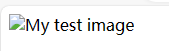

[TOC]

# 1 预备知识

## 文件结构

- **index.html**：这个文件一般会包含主页内容，也就是人们第一次进入网站时看到的文字和图片。使用文本编辑器，创建一个名为index.html的新文件，并将其保存在test-site文件夹内。
- **images 文件夹**：这个文件夹包含网站上使用的所有图片。在 test-site 文件夹内创建一个名为 images 的文件夹。
- **styles 文件夹**：这个文件夹包含用于设置内容样式的 CSS 代码（例如，设置文本和背景颜色）。在你的 test-site 文件夹内创建一个名为 styles 的文件夹。
scripts 文件夹：这个文件夹包含所有用于向网站添加交互功能的 JavaScript 代码（例如，点击时加载数据的按钮）。在 test-site 文件夹内创建一个名为 scripts 的文件夹。

## HTML语法
### element(元素)

- **开始标签（Opening tag）**：包含元素的名称（本例为 p），被大于号、小于号所包围。表示元素从这里开始或者开始起作用 —— 在本例中即段落由此开始。
- **结束标签（Closing tag）**：与开始标签相似，只是其在元素名之前包含了一个斜杠。这表示着元素的结尾 —— 在本例中即段落在此结束。初学者常常会犯忘记包含结束标签的错误，这可能会产生一些奇怪的结果。
- **内容（Content）**：元素的内容，本例中就是所输入的文本本身。
- **元素（Element）**：开始标签、结束标签与内容相结合，便是一个完整的元素。

元素也可以有属性（Attribute）：

`class` 是属性名称，`editor-note` 是属性的值

````html
<!doctype html>   <!--定义文档类型-->

<html>
<head>            <!--规定文档相关的配置信息（元数据），包括文档的标题，引用的文档样式和脚本等。 -->
    <meta charset="utf-8" />
    <meta name="viewport" content="width=device-width" />
    <title>My test page</title>
  </head>
  <body>
      <!--alt的值为图片秒速内容，用于障碍模式--> 
  </body>
</html>
```` 

该元素还包括一个替换文字属性 alt，是图像的描述内容，用于当图像不能被用户看见时显示，不可见的原因可能是：
- 用户有视觉障碍。视障用户可以使用屏幕阅读器来朗读 alt 属性的内容。
- 有些错误使图像无法显示。可以试着故意将 src 属性里的路径改错。保存并刷新页面就可以在图像位置看到alt的值:
  

### 标记文本

#### 标题（Heading）
HTML 包括六个级别的标题，` <h1> (en-US)–<h6> (en-US)`

#### 段落（Paragraph）
`<p> `元素是用来指定段落的。通常用于指定常规的文本内容:

#### 列表（List）
  
Web 上的许多内容都是列表，HTML 有一些特别的列表元素。标记列表通常包括至少两个元素。最常用的列表类型为：
- **无序列表（Unordered List）** 中项目的顺序并不重要，就像购物列表。用一个` <ul> `元素包围。
- **有序列表（Ordered List）** 中项目的顺序很重要，就像烹调指南。用一个 `<ol> `元素包围。
  
列表的每个项目用一个列表项目（List Item）元素` <li>` 包围。

#### 链接
链接非常重要 — 它们赋予 Web 网络属性。要植入一个链接，我们需要使用一个简单的元素 `<a> ` a 是 "anchor" （锚）的缩写。要将一些文本添加到链接中，格式如下。
 ````html
<a href="https://www.bing.com">anchor</a> 
 ````
 >备注： href 这个名字可能开始看起来有点令人费解，代表超文本引用（ hypertext reference）。

 ## CSS基础
 CSS（Cascading Style Sheets，层叠样式表）是为 web 内容添加样式的代码。CSS 是一门样式表语言，可以用它来选择性地为 HTML 元素添加样式。

 本章作业
 ````html
<!doctype html>   <!--定义文档类型-->

<html>
<head>            <!--规定文档相关的配置信息（元数据），包括文档的标题，引用的文档样式和脚本等。 -->
    <meta charset="utf-8" />
    <meta name="viewport" content="width=device-width" />


    <title>My test page</title>
  </head>
  <body>
    <h1>
      你好，世界！
    </h1>
      <!--alt的值为图片秒速内容，用于障碍模式--> 
    <p>
      这是我的一个网站，我需要写点东西用户有视觉障碍。视障用户可以使用屏幕阅读器来朗读 alt 属性的内容。
      有些错误使图像无法显示。可以试着故意将 src 属性里的路径改错。保存并刷新页面就可以在图像位置看到alt的值:
      <br>
      以下是我对有序列表的测试：
      <ol>
        <li>时间</li>
        <li>地点</li>
        <li>人物</li>
      </ol>

  <br>
      以下是我对无序列表的测试：
      <ul>
        <li>时间</li>
        <li>地点</li>
        <li>人物</li>
      </ul>
    </p>
    <a href="https://www.bing.com">anchor</a> 

  </body>
</html>
 ````